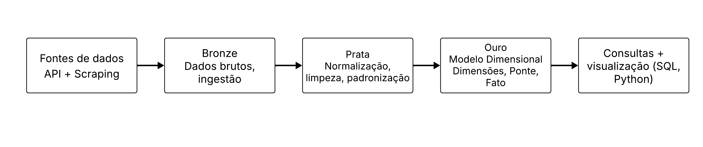
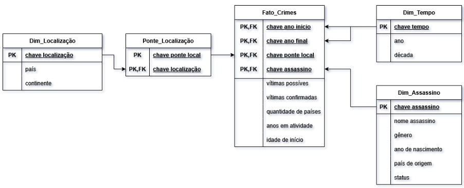
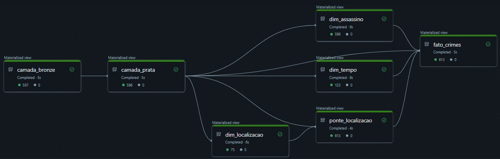

# Serial Killers Data Warehouse

Projeto acadêmico de **Data Warehouse e Engenharia de Dados** desenvolvido na disciplina de **Novas Tecnologias em Banco de Dados**, na UFSCar.

O projeto utiliza dados públicos da Wikipédia sobre serial killers para construir um pipeline de dados em **Databricks + PySpark**, passando por extração, limpeza, integração, modelagem dimensional e consultas analíticas.

> Este repositório tem finalidade de **documentação e portfólio**. O notebook foi desenvolvido no ambiente Databricks e não foi preparado para execução local.

---

## Visão geral

O objetivo do projeto foi construir um Data Warehouse capaz de organizar e analisar informações geográficas, temporais e demográficas relacionadas aos casos presentes na página *List of serial killers by number of victims* da Wikipédia.

A extração combina a página principal com informações adicionais obtidas nas páginas individuais dos criminosos. A partir disso, os dados percorrem uma arquitetura em camadas até chegarem a um modelo dimensional preparado para consultas analíticas.



O fluxo implementado foi:

```text
Wikipedia API + Web Scraping
            ↓
          Bronze
       dados brutos
            ↓
           Prata
limpeza, padronização e integração
            ↓
           Ouro
     modelo dimensional
            ↓
       Spark SQL
            ↓
consultas + visualizações
```

---

## Tecnologias

- Python
- PySpark
- Spark SQL
- Databricks
- Delta Tables
- Wikipedia API
- Web Scraping
- Matplotlib

---

## Fontes de dados

A fonte principal foi a página da Wikipédia **List of serial killers by number of victims**.

Também foram consultadas páginas individuais para complementar atributos que não estavam disponíveis diretamente na tabela principal, como:

- gênero;
- ano de nascimento;
- país de origem;
- status.

A extração inicial reuniu aproximadamente **597 registros** antes das etapas de tratamento.

---

## Arquitetura Bronze, Prata e Ouro

### Bronze

A camada Bronze preserva os dados coletados das fontes externas antes das transformações.

Ela serve como ponto inicial do pipeline e mantém as informações necessárias para as etapas posteriores de limpeza e integração.

### Prata

Na camada Prata são aplicadas as regras de tratamento dos dados, incluindo:

- remoção de caracteres e hyperlinks;
- separação de períodos de atividade em ano inicial e final;
- conversão de valores textuais para numéricos;
- padronização de países, status e gênero;
- integração entre a fonte principal e as páginas individuais;
- criação de atributos derivados.

### Ouro

Na camada Ouro os dados tratados são organizados no modelo dimensional utilizado pelas consultas analíticas.

As tabelas foram persistidas como **Delta Tables** no Databricks.

---

## Modelo dimensional



O Data Warehouse é composto por:

- `Fato_Crimes`
- `Dim_Assassino`
- `Dim_Tempo`
- `Dim_Localizacao`
- `Ponte_Localizacao`

### `Fato_Crimes`

Tabela central do modelo, contendo métricas como:

- vítimas possíveis;
- vítimas confirmadas;
- quantidade de países de atuação;
- anos em atividade;
- idade de início da atividade criminosa.

### `Dim_Assassino`

Contém atributos utilizados para análises demográficas:

- nome;
- gênero;
- ano de nascimento;
- país de origem;
- status.

### `Dim_Tempo`

Permite análises temporais através de:

- ano;
- década.

A dimensão é utilizada tanto para o início quanto para o fim do período de atividade.

### `Dim_Localizacao` e `Ponte_Localizacao`

`Dim_Localizacao` armazena países e continentes.

Como um mesmo assassino pode ter atuado em vários países, foi necessária uma **tabela ponte** para representar corretamente esse relacionamento multivalorado sem duplicar as informações da dimensão.

Essa modelagem permite consultar tanto casos associados a um único país quanto aqueles relacionados a múltiplas localizações.

---

## Implementação no Databricks

O pipeline foi implementado em PySpark no Databricks.

As dimensões, a tabela ponte e a fato foram construídas a partir da camada Prata e persistidas como tabelas Delta. O fluxo final pode ser visualizado diretamente no pipeline gerado no ambiente:



A implementação completa está disponível no notebook:

[`notebook/NTBD_FF_Grupo3_amanda_daniel.ipynb`](notebook/NTBD_FF_Grupo3_amanda_daniel.ipynb)

---

## Consultas analíticas

Após a construção da camada Ouro, o modelo foi utilizado para responder aos requisitos definidos para o projeto.

### 1. Vítimas associadas a assassinos que atuaram em múltiplos países

Consulta destinada a calcular o total de vítimas confirmadas e possíveis entre assassinos com atuação internacional.

### 2. Idade média de início por gênero

Utiliza a dimensão de assassinos e a fato para comparar a idade média de início das atividades entre os grupos disponíveis nos dados.

### 3. Impacto do uso de DNA forense

Compara a duração média dos anos em atividade antes e depois da adoção do DNA em investigações criminais, utilizando **1986** como marco definido no projeto.

### 4. América do Sul x América do Norte

Compara a quantidade de serial killers com status `PRESO` que iniciaram suas atividades na década de 1990, considerando os dois continentes.

As consultas completas e suas visualizações podem ser encontradas no notebook do projeto.

---

## Estrutura sugerida do repositório

```text
serial-killers-data-warehouse/
│
├── README.md
│
├── notebook/
│   └── NTBD_FF_Grupo3_amanda_daniel.ipynb
│
└── docs/
    ├── relatorio.pdf
    │
    └── images/
        ├── arquitetura.png
        ├── modelo_dimensional.png
        └── pipeline_databricks.png
```

Os arquivos de imagem utilizados neste README correspondem a:

```text
Fluxograma.png  → docs/images/arquitetura.png
image.png       → docs/images/modelo_dimensional.png
pipeline2.png   → docs/images/pipeline_databricks.png
```

---

## Documentação acadêmica

O relatório completo do projeto está disponível em:

[`docs/relatorio.pdf`](docs/relatorio.pdf)

Ele contém:

- definição do tema;
- requisitos de negócio;
- fontes de dados;
- projeto do Data Warehouse;
- mapeamento dos atributos;
- regras de ETL;
- projeto físico;
- descrição das consultas;
- considerações finais.

---

## Execução

O notebook foi desenvolvido especificamente no ambiente **Databricks** e contém dependências e recursos próprios da plataforma.

Por isso, este repositório **não tem como objetivo oferecer uma execução local reproduzível**.

O foco é registrar a implementação, as decisões de modelagem e os resultados do projeto acadêmico.

---

## Contexto acadêmico

Projeto desenvolvido em dupla por:

- **Amanda Akemi Perina Kouchi**
- **Daniel Oliveira Rocha**

Disciplina: **Novas Tecnologias em Banco de Dados**  
Curso: **Ciência da Computação — UFSCar**

---

## Principais aprendizados

O projeto permitiu aplicar de forma prática conceitos de:

- ETL;
- arquitetura em camadas Bronze, Prata e Ouro;
- processamento de dados com PySpark;
- integração de múltiplas fontes;
- tratamento e padronização de dados;
- modelagem dimensional;
- surrogate keys;
- relacionamento muitos-para-muitos com tabela ponte;
- Delta Tables;
- consultas analíticas com Spark SQL;
- visualização de resultados.

